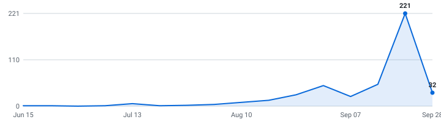

# 🎓 New Grad Tech Jobs

**A self-updating engine that tracks new grad tech roles for the Class of 2027 and Class of 2026 so you don't have to.**

&nbsp;&nbsp;&nbsp;

### 247 open roles (214 listed below) · 247 new this week

4,648 employers tracked · data as of Sep 30, 2026 at 15:05 UTC

_112 have a class year the employer stated · 135 are recent postings whose class year isn't stated (listed separately, never mixed in)._

**[🖥️ Live dashboard](https://apxxrv.github.io/New-Grad-Tech-Jobs/)** · **[📡 RSS](https://apxxrv.github.io/New-Grad-Tech-Jobs/feed.xml)** · **[⚙️ JSON API](https://apxxrv.github.io/New-Grad-Tech-Jobs/api/jobs.json)** · **[✉️ Email alerts](https://apxxrv.github.io/New-Grad-Tech-Jobs/#subscribe)**

> [!TIP]
> **⭐ Star this repo** to save it and get updates when new roles are added.

Instead of refreshing a dozen career pages by hand, it reads company hiring feeds directly and keeps one live list — newest roles on top, refreshed automatically throughout the day.

**🔔 New roles in your inbox:** [subscribe by email](https://apxxrv.github.io/New-Grad-Tech-Jobs/#subscribe) - one email a day, only when new grad roles actually appeared, unsubscribe from any email in two clicks. (Prefer RSS-to-email? [Feedrabbit works too](https://feedrabbit.com/subscriptions/new?url=https%3A%2F%2Fraw.githubusercontent.com%2Fapxxrv%2FNew-Grad-Tech-Jobs%2Fmain%2Fdocs%2Ffeed.xml).)

---

## What this is

This is an engine, not a hand-kept list. It polls company career feeds every 30 minutes, finds the new grad roles, removes duplicates, and rebuilds this page on its own.

Every link comes straight from the source — so it's real and current, not a stale list someone forgot to update. Speed matters.

## What makes this different

| | |
|---|---|
| 📅 **[Drop Radar](#drop-radar)** | A forecast of **what's coming**. Each marquee company's typical opening window, replaced by the real drop date the moment the engine catches it live. Windows are estimates and labelled as such; only dates the engine saw itself are marked verified. |
| 🛂 **Visa intel, computed** | 🇺🇸 / 🛂 flags detected automatically from every job description, plus ✓ for employers with a real H-1B track record (USCIS data, FY2022-23 — a history, not a promise). The big lists crowdsource this by hand; here it's code. Most postings say nothing either way, and those show as unknown rather than guessed. |
| 📆 **A real date on nearly every role** | Taken from the job portal itself wherever the portal states one, so newest-first actually means newest. The exact coverage figure is printed at the bottom of this page every run. |
| 🧰 **Skill tags + pay, extracted** | Every posting's text is scanned for the stack it wants (Python, C++, PyTorch, …) and the pay it states — searchable on the [dashboard](https://apxxrv.github.io/New-Grad-Tech-Jobs/), and included in the CSV and API. |
| 🔔 **Alerts your way** | [Email digests](https://apxxrv.github.io/New-Grad-Tech-Jobs/#subscribe) or [RSS](https://apxxrv.github.io/New-Grad-Tech-Jobs/feed.xml) — point any reader, or a Slack/Discord RSS integration, at it. Plus a [live dashboard](https://apxxrv.github.io/New-Grad-Tech-Jobs/) with search, filters, and a saved-roles list that never leaves your browser. |
| ⚙️ **An engine, not a spreadsheet** | 4,911 job-board endpoints (4,648 distinct employers; some run more than one board) polled every 30 minutes across 12 ATS platforms. Full source and tests in this repo. |

## Scope

| | |
|---|---|
| **Roles** | Software Engineering, Data Science & Machine Learning (and closely related technical new grad roles) |
| **Region** | United States |
| **Class years** | Class of 2027 and Class of 2026 |

## About

I'm an international student in the United States, graduating soon, and this is the search I'm doing myself. I forked zshah101's internship engine and pointed it at new grad roles instead, because the same boards, the same sponsorship signals, and the same speed advantage all carry over. The list is US roles only for now — that's where I'm searching.

**Built on** [zshah101/Automated-List-Of-Summer-2027-and-Fall-2026-Tech-Internships](https://github.com/zshah101/Automated-List-Of-Summer-2027-and-Fall-2026-Tech-Internships) (MIT).

Use it to spot roles early and apply before they fill up. Being first genuinely helps.

## Where this is going

I'm building this in the open and adding to it as it grows.

**Recently shipped:** email alerts · the Drop Radar · auto-detected sponsorship flags · the live dashboard

**Next up:** personalized alerts (pick your categories) · per-company hiring pages · a ghost-posting detector

If it helps you, a star means a lot and tells me to keep going.

## How to use

<b>Reading the table — flags, dates, and the class year split</b> (click to expand)

- Roles are grouped by class year below - **newest posting on top, oldest at the bottom.**
- A class year section holds only roles whose **employer stated that class year** - in the title, or in the posting's own text. Postings that name no class year anywhere are in *Recently posted — class year not stated* further down, with **no class year guessed for them**. Same quality bar, different amount of evidence.
- **Apply** is the third column, right after the role, so the link is on screen even when the table is wider than your window.
- The **Posted** column is the date the company published the role.
- **_(3 openings)_ after a role title** = the employer has that many separate live requisitions for the same job, in the same place, for the same class year. They're all real and each takes its own application, so they're linked individually (**Apply**, then **#2**, **#3**) instead of repeating the row. Counts still count requisitions, and the CSV export is never grouped.
- **🆁 after a company name** = **this role is remote** — the posting's own location or title says so. It marks the role on that row, not the whole company.
- **Flags after a role title:** 🇺🇸 = requires U.S. citizenship or a security clearance · 🛂 = the posting says it won't sponsor a work visa · 🆕 = spotted in the last 48 hours. Sponsorship flags are detected automatically from each job description - treat them as a strong hint and confirm on the posting.
- **✓ after a company name** = a real H-1B track record: USCIS approved 10+ petitions for that employer in FY2022–2023 (matched automatically against the official [H-1B Employer Data Hub](https://www.uscis.gov/tools/reports-and-studies/h-1b-employer-data-hub)). No ✓ doesn't mean they won't sponsor - it means we can't prove they have.
- Track your applications with [`data/new_grad_jobs.csv`](data/new_grad_jobs.csv) (opens in Excel / Google Sheets).
- Missing a company? Adding one takes a single line, see [CONTRIBUTING.md](CONTRIBUTING.md).

---

## Class of 2027  (64 employer-stated)

| Company | Role | Apply | Location | Skills | Posted |
|---|---|---|---|---|---|
| Global​Foundries | AI/ML Analytics Engineer (2027 New College Graduate) 🆕 | [Apply](https://globalfoundries.wd1.myworkdayjobs.com/External/job/USA---New-York---Malta/AI-ML-Analytics-Engineer--2027-New-College-Graduate-_JR-2604942) | USA - New York - Malta | Python, SQL | Sep 28, 2026 |
| SpaceX | New Graduate Engineer, Software (Starfall) 🆕 _(also open for Class of 2026)_ | [Apply](https://boards.greenhouse.io/spacex/jobs/8854394002?gh_jid=8854394002) | Hawthorne, CA | C++, Bash, Linux | Sep 28, 2026 |
| Voloridge | Quantitative Developer - 2026/2027 Grads _(also open for Class of 2026)_ | [Apply](https://job-boards.greenhouse.io/voloridgeinvestmentmanagement/jobs/4419326009) | Jupiter, FL | Python, C++ | Sep 24, 2026 |
| ZipRecruiter ✓ | Software Engineer - New Grad | [Apply](https://job-boards.greenhouse.io/ziprecruiter/jobs/8127108) | Santa Monica, CA | Python, Java, C++, JavaScript | Sep 24, 2026 |
| Mastercard | Site Reliability Engineer I, Launch Program 2027 – St. Louis, MO, US | [Apply](https://mastercard.wd1.myworkdayjobs.com/Campus/job/OFallon-Missouri/Site-Reliability-Engineer-I--Launch-Program-2027---St-Louis--MO--US_R-287642) | O'Fallon, Missouri | Python, Bash, AWS, GCP | Sep 24, 2026 |
| Graphcore | Graduate Firmware Engineer | [Apply](https://job-boards.greenhouse.io/graphcore/jobs/8841995002) | Austin, Texas, United States | Python, C++, Linux | Sep 23, 2026 |
| Klaviyo ✓ | AI Engineer I | [Apply](https://job-boards.greenhouse.io/klaviyocampus/jobs/8003259003) | Boston, MA | Python, LLMs, Django | Sep 23, 2026 |
| Scale AI ✓ | Software Engineer, Public Sector - New Grad | [Apply](https://job-boards.greenhouse.io/scaleai/jobs/4736426005) | San Francisco, CA | Python, TypeScript, LLMs, React | Sep 23, 2026 |
| Anduril | 2027 Early Career Firmware Engineer | [Apply](https://boards.greenhouse.io/andurilindustries/jobs/5246141007?gh_jid=5246141007) | Costa Mesa, California, United States | Computer Vision | Sep 22, 2026 |
| Applied Materials ✓ | 2027 Software Engineer New College Grad (Bachelor's) - Gloucester, MA | [Apply](https://amat.wd1.myworkdayjobs.com/External/job/GloucesterMA/XMLNAME-2027-Software-Engineer-New-College-Grad--Bachelor-s----Gloucester--MA_R2625914) | Gloucester​,MA | C++, C# | Sep 20, 2026 |
| Radiant | 2027 New Graduate - Software Engineer | [Apply](https://jobs.ashbyhq.com/radiant-industries/1ec29cec-d18f-417d-adc6-31adda87c687) | El Segundo, CA | Python, C++, C#, Git | Sep 17, 2026 |
| CoStar Group | Associate Software Engineer - Irvine, CA 🛂 | [Apply](https://costar.wd1.myworkdayjobs.com/Costar_Campus/job/Irvine-US/Associate-Software-Engineer---Irvine--CA_R39736) | Irvine (US) | TypeScript, JavaScript, SQL, React | Sep 16, 2026 |
| CoStar Group | Associate Software Engineer - San Diego, CA 🛂 | [Apply](https://costar.wd1.myworkdayjobs.com/Costar_Campus/job/US-CA-San-Diego/Associate-Software-Engineer---San-Diego--CA_R39674) | US-CA San Diego | TypeScript, JavaScript, SQL, React | Sep 16, 2026 |
| SingleStore ✓ | Software Engineer-Helios-New Grad 2027 | [Apply](https://job-boards.greenhouse.io/singlestore/jobs/8205389) | United States | TypeScript, JavaScript, SQL | Sep 15, 2026 |
| SingleStore ✓ | Software Engineer-Engine-New Grad 2027 | [Apply](https://job-boards.greenhouse.io/singlestore/jobs/8205427) | United States | C++, SQL, LLMs | Sep 15, 2026 |
| NOV | Associate Software Engineer - Pathway (June 2027 & January 2027) | [Apply](https://egay.fa.us6.oraclecloud.com/hcmUI/CandidateExperience/en/sites/CX_4001/job/44448) | Houston, TX, United States | Python, Java, C++, C# | Sep 15, 2026 |
| LexisNexis Risk Solutions ✓ | Aspire Tech Graduate Data Scientist I | [Apply](https://relx.wd3.myworkdayjobs.com/LexisNexisLegal/job/Raleigh-NC/Aspire-Tech-Graduate-Data-Scientist-I_R118695) | Raleigh, NC | LLMs, HTML/CSS | Sep 15, 2026 |
| LexisNexis Risk Solutions ✓ | Aspire Tech Graduate Software Engineer I | [Apply](https://relx.wd3.myworkdayjobs.com/LexisNexisLegal/job/Raleigh-NC/Aspire-Tech-Graduate-Software-Engineer-I_R118694) | Raleigh, NC | Java, C++, C#, JavaScript | Sep 15, 2026 |
| CoStar Group | Associate Security Engineer - Arlington, VA 🛂 | [Apply](https://costar.wd1.myworkdayjobs.com/Costar_Campus/job/US-VA-Arlington/Associate-Security-Engineer---Arlington--VA_R39724) | US-VA Arlington | Python, Bash | Sep 14, 2026 |
| Klaviyo ✓ | Software Engineer I 🛂 | [Apply](https://job-boards.greenhouse.io/klaviyocampus/jobs/7989324003) | Boston, MA | Python, TypeScript, React, Django | Sep 12, 2026 |
| SpaceX | New Graduate Engineer, Security Software (Starshield) | [Apply](https://boards.greenhouse.io/spacex/jobs/8802897002?gh_jid=8802897002) | Washington, DC | Python, C++, Go | Sep 11, 2026 |
| SEP | Software Engineer (2027 start dates, in person) 🛂 | [Apply](https://jobs.lever.co/sep/f7ad9ffb-03dc-4fb2-9a92-e5f04a85ba08) | Westfield, IN | No skills listed | Sep 10, 2026 |
| Greenboard | Software Engineer (2027 Grads) | [Apply](https://jobs.ashbyhq.com/greenboard/e5deef5b-8667-48d7-be48-a0b6616eaba5) | New York City | Python, AWS | Sep 09, 2026 |
| Replit | Software Engineer - New Grad (2027) | [Apply](https://jobs.ashbyhq.com/replit/b5e81eae-06f9-4798-8988-2d06ca936dbc) | Foster City, CA | Python, Rust, TypeScript, JavaScript | Sep 09, 2026 |
| ID.me | Summer 2027 - Data Scientist (New Grad) | [Apply](https://job-boards.greenhouse.io/idmeuniversityrecruiting/jobs/7986505003) | Mountain View, CA | Python, SQL, PyTorch, TensorFlow | Sep 08, 2026 |
| SpaceX | New Graduate Engineer, Software (Starship) | [Apply](https://boards.greenhouse.io/spacex/jobs/8743362002?gh_jid=8743362002) | Hawthorne, CA | C++, Rust | Sep 08, 2026 |
| DoorDash ✓ | Software Engineer I, Entry-Level (Graduation Date: Fall 2026-Summer 2027) - US | [Apply](https://job-boards.greenhouse.io/doordashusa/jobs/8163709) | Los Angeles +9 more | Python, Java, SQL, Kotlin | Sep 04, 2026 |
| Garner Health | Associate Software Engineer 🛂 | [Apply](https://job-boards.greenhouse.io/garnerhealth/jobs/6174210004) | New York City, New York | Python, TypeScript, JavaScript, React | Sep 04, 2026 |
| ID.me | Summer 2027- Software Development Engineer - New Grad | [Apply](https://job-boards.greenhouse.io/idmeuniversityrecruiting/jobs/7980382003) | Mountain View, CA | Python, Java, JavaScript, Ruby | Sep 04, 2026 |
| Scale AI ✓ | Software Engineer - New Grad | [Apply](https://job-boards.greenhouse.io/scaleai/jobs/4730836005) | San Francisco, CA | Python, TypeScript, LLMs, React | Sep 04, 2026 |
| Anduril | 2027 Early Career Flight Software Engineer | [Apply](https://boards.greenhouse.io/andurilindustries/jobs/5228868007?gh_jid=5228868007) | Costa Mesa, California, United States | Python, MATLAB, Computer Vision | Sep 02, 2026 |
| American Express ✓ | Campus Undergradu​ate Full-Time Engineer - 2027 Software Engineer I, Enterprise Technology Services- New York, NY | [Apply](https://egug.fa.us2.oraclecloud.com/hcmUI/CandidateExperience/en/sites/CX_1/job/26012796) | New York, NY, United States | Python, Java, C#, TypeScript | Sep 02, 2026 |
| American Express ✓ | Campus Undergradu​ate Full-Time Engineer - 2027 Software Engineer I, Enterprise Technology Services- Sunrise, FL | [Apply](https://egug.fa.us2.oraclecloud.com/hcmUI/CandidateExperience/en/sites/CX_1/job/26012801) | Sunrise, FL, United States | Python, Java, C#, TypeScript | Sep 02, 2026 |
| American Express ✓ | Campus Undergradu​ate Full-Time Engineer - 2027 Software Engineer I, Enterprise Technology Services- Charlotte, NC | [Apply](https://egug.fa.us2.oraclecloud.com/hcmUI/CandidateExperience/en/sites/CX_1/job/26012869) | Charlotte, NC, United States | Python, Java, C#, TypeScript | Sep 02, 2026 |
| Equifax ✓ | Site Reliability Engineer - Rotational Development Program | [Apply](https://equifax.wd5.myworkdayjobs.com/UR_External/job/USA---Missouri---St-Louis---Lackland/Site-Reliability-Engineer---Rotational-Development-Program_J00178675) | USA - Missouri - St. Louis - Lackland | Java, AWS, GCP, Azure | Sep 01, 2026 |
| Sierra | Software Engineer, Agent (New Grad 2027) | [Apply](https://jobs.ashbyhq.com/sierra/149f368c-52d5-408f-ba26-ad888f318a00) | San Francisco, CA | TypeScript, LLMs, React | Aug 31, 2026 |
| CapTech Consulting | Software Engineering Associate Consultant (Graduating Dec. 2026 - Summer 2027) 🛂 _(also open for Class of 2026)_ | [Apply](https://jobs.smartrecruiters.com/CapTechConsulting/744000146449269) | Richmond, VA, United States | Python, Java, C#, TypeScript | Aug 31, 2026 |
| RELX | Tech Accelerate Graduate Program - Software Engineer (Alpharetta - January) | [Apply](https://relx.wd3.myworkdayjobs.com/relx/job/Alpharetta-GA/Tech-Accelerate-Graduate-Program---Software-Engineer--Alpharetta---January-_R117617-1) | Alpharetta, GA | Python, Java, C++, JavaScript | Aug 31, 2026 |
| RELX | Tech Accelerate Graduate Program - Software Engineer (Alpharetta - June) | [Apply](https://relx.wd3.myworkdayjobs.com/relx/job/Alpharetta-GA/Tech-Accelerate-Graduate-Program---Software-Engineer--Alpharetta---June-_R117626-2) | Alpharetta, GA | Python, Java, C++, JavaScript | Aug 31, 2026 |
| LexisNexis Risk Solutions ✓ | Tech Accelerate Graduate Program - Software Engineer (Boca Raton - June) | [Apply](https://relx.wd3.myworkdayjobs.com/RiskSolutions/job/Boca-Raton-FL/Tech-Accelerate-Graduate-Program---Software-Engineer--Boca-Raton---June-_R116023-2) | Boca Raton, FL | Python, Java, C++, JavaScript | Aug 31, 2026 |
| Solace Health | Associate Data Scientist (College Grad 2027) | [Apply](https://jobs.ashbyhq.com/solace/77ca492c-4142-4931-beeb-e85d9d0ac443) | Redwood City, CA | Python, SQL, PyTorch, scikit-learn | Aug 28, 2026 |
| Global Lending Services | Data Scientist - December 2026 - May 2027 Grads _(also open for Class of 2026)_ | [Apply](https://jobs.lever.co/glsllc/d81bfc16-2ba1-41ca-ab21-7d8cffac9e07) | Greenville, South Carolina | Python, SQL, scikit-learn | Aug 27, 2026 |
| Solace Health | Associate Platform Engineer (College Grad 2027) | [Apply](https://jobs.ashbyhq.com/solace/bbdb1020-2900-4d63-908a-20cea79a65cd) | Redwood City, CA | PyTorch, AWS, GCP, Kubernetes | Aug 25, 2026 |
| Solace Health | Associate Software Engineer (College Grad 2027) | [Apply](https://jobs.ashbyhq.com/solace/db008474-d93e-41a7-939e-8d5825eb0d0f) | Redwood City, CA | Python, Java, TypeScript, JavaScript | Aug 25, 2026 |
| Metron | Associate Software Engineer 🇺🇸 | [Apply](https://job-boards.greenhouse.io/metron/jobs/5211456007) | Reston, VA | Python, Java, C++, TypeScript | Aug 25, 2026 |
| Freeform | Software Engineer (New Grad Summer 2027) | [Apply](https://job-boards.greenhouse.io/freeformfuturecorp/jobs/7895902003) | Los Angeles, CA (On-site) | C++, Rust, Linux | Aug 19, 2026 |
| DV Trading | 2027 Graduate Software Engineer (DV Commodities) | [Apply](https://job-boards.greenhouse.io/dvtrading/jobs/4719126005) | New York | Python, C++, Linux | Aug 10, 2026 |
| WeRide ✓ | New Grads 2027 - Software Engineer, Algorithm 🛂 | [Apply](https://jobs.lever.co/weride/5a7cbc83-2381-482e-9d6d-e9c9d59ad63b) | San Jose, CA | Python, C++, PyTorch, TensorFlow | Aug 10, 2026 |
| WeRide ✓ | New Grads 2027 - Software Engineer - Perception/Computer Vision 🛂 | [Apply](https://jobs.lever.co/weride/5cde0d09-ba2d-408d-947e-4a42028cd4f7) | San Jose, CA | Computer Vision, Python, C++, LLMs | Aug 10, 2026 |
| Roblox ✓ | [2027] Software Engineer, Early Career | [Apply](https://careers.roblox.com/jobs/8072244?gh_jid=8072244) | San Mateo, CA, United States | Python, Java, C++, C# | Aug 05, 2026 |
| Belvedere Trading | Software Engineer - Entry Level 2027 | [Apply](https://jobs.lever.co/belvederetrading/2f6480e5-7bf1-4c41-b3b5-3c7404d95b5f) | Chicago, Illinois | Java, C++, C# | Aug 04, 2026 |
| Belvedere Trading | Quantitative Trader - Entry Level 2027 | [Apply](https://jobs.lever.co/belvederetrading/34369a5c-55c0-4e9f-9d2e-4f21b9418bee) | Chicago, Illinois | Python, C++, C# | Aug 04, 2026 |
| Old Mission Capital | Quantitative Researcher (Ph.D.) - 2027 Graduate Program - (August Start) | [Apply](https://www.oldmissioncapital.com/careers/?gh_jid=7814534003) | Chicago, IL, United States | Python, C++ | Jul 30, 2026 |
| Chicago Trading Company | Quant Trading Associate - 2027 Start | [Apply](https://job-boards.greenhouse.io/ctccampusboard/jobs/4708724005) | Chicago, IL | Python | Jul 15, 2026 |
| Old Mission Capital | Quantitative Trader – 2027 Graduate Program (February Start) | [Apply](https://www.oldmissioncapital.com/careers/?gh_jid=7796031003) | Chicago, IL or New York, NY | Python, C++ | Jul 13, 2026 |
| Old Mission Capital | Quantitative Trader – 2027 Graduate Program (August Start) | [Apply](https://www.oldmissioncapital.com/careers/?gh_jid=7796044003) | Chicago, IL or New York, NY | Python, C++ | Jul 13, 2026 |
| Hudson River Trading ✓ | Algorithm Developer (Quant Research & Trading) – 2027 Grads | [Apply](https://www.hudsonrivertrading.com/careers/job/?gh_jid=8052050) | London +5 more | Python, C++, MATLAB, Pandas | Jul 13, 2026 |
| Hudson River Trading ✓ | Software Engineer (C++ or Python) – 2027 Grads | [Apply](https://www.hudsonrivertrading.com/careers/job/?gh_jid=8052122) | Austin +11 more | Python, C++, Linux | Jul 13, 2026 |
| Momentum | 2027 Launch Graduate Program: Associate Cybersecur​ity Analyst | [Apply](https://job-boards.greenhouse.io/momentumcompany3/jobs/8614696002) | Dallas, Texas | Python, Bash | Jul 08, 2026 |
| Anduril | 2027 Early Career Software Engineer | [Apply](https://boards.greenhouse.io/andurilindustries/jobs/5162263007?gh_jid=5162263007) | Atlanta +26 more | Python, Java, C++, Rust | Jun 11, 2026 |
| Ellipsis Labs | Software Engineer - 2027 New Grads | [Apply](https://jobs.ashbyhq.com/ellipsislabs/256c2ec2-01c8-4ff6-9ad0-b926fe40472d) | New York, New York | Python, Java, C++, Rust | Mar 26, 2026 |
| Veeva Systems ✓ | Associate Software Engineer - 2027 Start Dates 🛂 | [Apply](https://jobs.lever.co/veeva/52ba79af-1086-457d-b5d2-8e184f111ffd) | Massachuse​tts - Boston | Python, Java, Rust, TypeScript | Aug 20, 2025 |
| Veeva Systems ✓ | Associate Software Engineer - 2027 Start Dates 🛂 | [Apply](https://jobs.lever.co/veeva/8fe22df0-02b4-453d-919c-c8998cf913f6) | California - Pleasanton | Python, Java, Rust, TypeScript | Aug 20, 2025 |
| Veeva Systems ✓ | Associate Software Engineer - 2027 Start Dates 🛂 | [Apply](https://jobs.lever.co/veeva/907dccc7-0052-41e9-920b-28e5ba6aaba9) | Ohio - Columbus | Python, Java, Rust, TypeScript | Aug 20, 2025 |

## Class of 2026  (26 employer-stated)

| Company | Role | Apply | Location | Skills | Posted |
|---|---|---|---|---|---|
| Northrop Grumman | 2026 Associate Software Engineer or Software Engineer - Aurora CO 🇺🇸 🆕 | [Apply](https://ngc.wd1.myworkdayjobs.com/Northrop_Grumman_External_Site/job/United-States-Colorado-Aurora/XMLNAME-2026-Associate-Software-Engineering-or-Software-Engineer---Aurora-CO_R10253437) | United States-Colorado-Aurora | Python | Sep 30, 2026 |
| Anduril | Space Orbital Software Engineer, Emerging Talent 🆕 | [Apply](https://boards.greenhouse.io/andurilindustries/jobs/5236290007?gh_jid=5236290007) | Costa Mesa, California, United States | Python, C++, Rust, Computer Vision | Sep 28, 2026 |
| SpaceX | New Graduate Engineer, Software (Starfall) 🆕 _(also open for Class of 2027)_ | [Apply](https://boards.greenhouse.io/spacex/jobs/8854394002?gh_jid=8854394002) | Hawthorne, CA | C++, Bash, Linux | Sep 28, 2026 |
| Voloridge | Quantitative Developer - 2026/2027 Grads _(also open for Class of 2027)_ | [Apply](https://job-boards.greenhouse.io/voloridgeinvestmentmanagement/jobs/4419326009) | Jupiter, FL | Python, C++ | Sep 24, 2026 |
| General Motors ✓ | Software Engineer AV HIL Platform and Services (Early Career)) | [Apply](https://generalmotors.wd5.myworkdayjobs.com/Careers_GM/job/Sunnyvale-California-United-States-of-America/Software-Engineer-AV-HIL-Platform-and-Services--University-Grad-_JR-202604577) | Sunnyvale +2 more | Python, C++, SQL, Linux | Sep 23, 2026 |
| NVIDIA ✓ | Research Scientist, Physical AI - Foundation Models - PhD New College Grad 2026 | [Apply](https://nvidia.wd5.myworkdayjobs.com/NVIDIAExternalCareerSite/job/US-CA-Santa-Clara/Research-Scientist--Generative-AI-for-Physical-AI---PhD-New-College-Grad-2026_JR2016032) | US, CA, Santa Clara | PyTorch, LLMs | Sep 23, 2026 |
| NVIDIA ✓ | Research Scientist, Networking Research - PhD New College Grad 2026 | [Apply](https://nvidia.wd5.myworkdayjobs.com/NVIDIAExternalCareerSite/job/US-CA-Santa-Clara/Research-Scientist--Networking-Research---PhD-New-College-Grad-2026_JR2024900-1) | US, CA, Santa Clara | Python, C++, PyTorch, TensorFlow | Sep 18, 2026 |
| Meow | Software Engineer - December 2026 Graduates 🛂 | [Apply](https://jobs.ashbyhq.com/meow/56e3b840-11a0-4e98-baca-44e8e26b5218) | New York City | Python, TypeScript, React, PostgreSQL | Sep 17, 2026 |
| Stripe ✓ | Software Engineer, Early Career — Immediate Start | [Apply](https://stripe.com/jobs/search?gh_jid=8212508) | San Francisco, Seattle, New York | Java, JavaScript, Scala, Ruby | Sep 17, 2026 |
| Anduril | Firmware Engineer, Space Emerging Talent | [Apply](https://boards.greenhouse.io/andurilindustries/jobs/5239596007?gh_jid=5239596007) | Costa Mesa, California, United States | Python, C++, Rust, Computer Vision | Sep 16, 2026 |
| Okta ✓ | Developer Support Associate (New Grad) | [Apply](https://www.okta.com/company/careers/opportunity/8191506?gh_jid=8191506) | Chicago, Illinois | JavaScript | Sep 14, 2026 |
| General Motors ✓ | ML Systems Engineer, Data Labeling Engineering - Early Career | [Apply](https://generalmotors.wd5.myworkdayjobs.com/Careers_GM/job/Sunnyvale-California-United-States-of-America/ML-Systems-Engineer--Data-Labeling-Engineering---Early-Career_JR-202619939) | Sunnyvale +2 more | Python, Java, C++, Go | Sep 09, 2026 |
| General Motors ✓ | Software Engineer, AV Frameworks – Early Career | [Apply](https://generalmotors.wd5.myworkdayjobs.com/Careers_GM/job/Sunnyvale-California-United-States-of-America/Software-Engineer--AV-Frameworks---Early-Career_JR-202619943) | Sunnyvale +2 more | Python, C++, Linux, ROS | Sep 09, 2026 |
| Amazon ✓ | Software Development Engineer, Amazon Dedicated Cloud, Early Career - 2026 🇺🇸 🆕 | [Apply](https://www.amazon.jobs/en/jobs/10529546/software-development-engineer-amazon-dedicated-cloud-early-career-2026) | Seattle, Washington, USA | Python, Java, C++, C# | Sep 04, 2026 |
| CapTech Consulting | Software Engineering Associate Consultant (Graduating Dec. 2026 - Summer 2027) 🛂 _(also open for Class of 2027)_ | [Apply](https://jobs.smartrecruiters.com/CapTechConsulting/744000146449269) | Richmond, VA, United States | Python, Java, C#, TypeScript | Aug 31, 2026 |
| Global Lending Services | Data Scientist - December 2026 - May 2027 Grads _(also open for Class of 2027)_ | [Apply](https://jobs.lever.co/glsllc/d81bfc16-2ba1-41ca-ab21-7d8cffac9e07) | Greenville, South Carolina | Python, SQL, scikit-learn | Aug 27, 2026 |
| Amazon ✓ | Software Development Engineer, Amazon Leo, Early Career - 2026 🇺🇸 🆕 | [Apply](https://www.amazon.jobs/en/jobs/10513110/software-development-engineer-amazon-leo-early-career-2026) | Redmond, Washington, USA | Python, Java, C++, C# | Aug 25, 2026 |
| SpaceX | New Graduate Engineer, Software Security - '26/'27 (Starlink) _(also open for Class of 2027)_ | [Apply](https://boards.greenhouse.io/spacex/jobs/8724316002?gh_jid=8724316002) | Hawthorne, CA | Python, C++, Go | Aug 19, 2026 |
| Notion | Software Engineer, New Grad (Dec 2026) | [Apply](https://jobs.ashbyhq.com/notion/e32799d2-8ef8-4803-8189-c72514afa816) | San Francisco, California | Python, TypeScript, JavaScript, React | Aug 14, 2026 |
| SpaceX | New Graduate Engineer, Software - '26/'27 (Starlink) _(also open for Class of 2027)_ | [Apply](https://boards.greenhouse.io/spacex/jobs/8696058002?gh_jid=8696058002) | Redmond, WA | Python, C++, C# | Aug 14, 2026 |
| Freeform | Software Engineer (New Grad December 2026) | [Apply](https://job-boards.greenhouse.io/freeformfuturecorp/jobs/7826634003) | Los Angeles, CA (On-site) | C++, Rust, Linux | Aug 07, 2026 |
| Color | Software Engineer, New Grad 2026 | [Apply](https://jobs.ashbyhq.com/color-health/41fa6f16-b2f2-46c6-bdb4-9aae3b9b5b96) | South San Francisco, California | Python, SQL, LLMs, React | Jul 28, 2026 |
| NVIDIA ✓ | Research Scientist, Robotics Research -  PhD New College Grad 2026 | [Apply](https://nvidia.wd5.myworkdayjobs.com/NVIDIAExternalCareerSite/job/US-WA-Seattle/Research-Scientist--Robotics-Research----PhD-New-College-Grad-2026_JR2011473) | US, WA, Seattle | Python, C++, PyTorch, Computer Vision | Jul 24, 2026 |
| Global​Foundries | Global Tapeout and Mask Operations, Biz App and Data Engineer (2026 New College Graduate) | [Apply](https://globalfoundries.wd1.myworkdayjobs.com/External/job/USA---Texas---Austin/Global-Tapeout-and-Mask-Operations--Biz-App-and-Data-Engineer--2026-New-College-Graduate-_JR-2502471-1) | USA - Texas - Austin | Python, Angular, AWS, Git | Jun 24, 2026 |
| Lila Sciences | AI Residency Program, Material Science (2026 Cohort) | [Apply](https://job-boards.greenhouse.io/lilasciences/jobs/4031379009) | Cambridge, MA USA | Python, PyTorch, LLMs | Oct 06, 2025 |
| Anduril | 2026 Early Career Software Engineer | [Apply](https://boards.greenhouse.io/andurilindustries/jobs/4802146007?gh_jid=4802146007) | Atlanta +14 more | Python, Java, C++, Rust | Aug 11, 2025 |

## Recently posted — class year not stated  (122 roles)

These postings never name a class year — not in the title, not in the posting text — so neither do we. They're recent new grad tech roles (posted within the last few weeks), often exactly the early drops worth applying to first; we just can't tell you which class year they're for, and we'd rather say so than guess. The moment a posting's own text states a class year, the role moves up into that section automatically.

| Company | Role | Apply | Location | Skills | Posted |
|---|---|---|---|---|---|
| Bristol Myers Squibb ✓ | Process Data Engineer I - Pharmaceut​ical Product Development 🆕 | [Apply](https://bristolmyerssquibb.wd5.myworkdayjobs.com/bms/job/Hyderabad---TS---IN/Process-Data-Engineer-I---Pharmaceutical-Product-Development_R1605604-1) | Hyderabad - TS - IN | Python, SQL, LLMs, AWS | Sep 30, 2026 |
| Renaissance 🆁 | Data Analyst I 🛂 🆕 | [Apply](https://job-boards.greenhouse.io/renaissancelearning-nam/jobs/5434355008) | Remote - US | SQL, Linux | Sep 29, 2026 |
| RTX | Software Engineer I (Onsite) 🇺🇸 🆕 | [Apply](https://globalhr.wd5.myworkdayjobs.com/rec_rtx_ext_gateway/job/US-IA-CEDAR-RAPIDS-105--400-Collins-Rd-NE--BLDG-105/Software-Engineer-I--Onsite-_01861196) | US-IA-CEDAR RAPIDS-105 ~ 400 Collins Rd… | Python, Linux, Git | Sep 29, 2026 |
| Truist Bank ✓ | Data Scientist I 🆕 | [Apply](https://truist.wd1.myworkdayjobs.com/Careers/job/Charlotte-NC---Telecommuter/Data-Scientist-I_R0119496-1) | Charlotte NC - Telecommuter | Python, SQL, Hadoop | Sep 29, 2026 |
| Bristol Myers Squibb ✓ | Data Engineer I - Transparency Data Operations 🆕 | [Apply](https://bristolmyerssquibb.wd5.myworkdayjobs.com/bms/job/Hyderabad---TS---IN/Data-Engineer-I---Transparency-Data-Operations_R1606573) | Hyderabad - TS - IN | Python, SQL, AWS, Git | Sep 28, 2026 |
| Clearway Energy | ESM Developer I 🛂 🆕 | [Apply](https://job-boards.greenhouse.io/clearwayjobs/jobs/5238286007) | San Diego, California, United States | JavaScript, SQL, LLMs, HTML/CSS | Sep 28, 2026 |
| Schonfeld | Entry Level Quantitative Researcher 🆕 | [Apply](https://job-boards.greenhouse.io/schonfeld/jobs/8236826) | New York, New York, United States | Python, C++, Rust, JavaScript | Sep 28, 2026 |
| Lightcast | Economic Research Analyst / Junior Data Scientist - 1089 | [Apply](https://jobs.lever.co/economicmodeling/33baa88b-3388-4402-9a5c-b00914351277) | Moscow, ID | Python, SQL, LLMs, Snowflake | Sep 25, 2026 |
| Allegion | Associate Analytics Engineer | [Apply](https://allegion.wd5.myworkdayjobs.com/careers/job/Carmel-IN/Associate-Analytics-Engineer_JR36667) | Carmel, IN | SQL | Sep 25, 2026 |
| Epiq Systems | Associate Platform Engineer | [Apply](https://epiqsystems.wd503.myworkdayjobs.com/Epiq_Careers/job/Tampa-FL/Associate-Platform-Engineer_R0035190) | Tampa, FL | Python, Bash, AWS, Azure | Sep 25, 2026 |
| Mass General Brigham ✓ | Information Security Analyst  I - Automation | [Apply](https://massgeneralbrigham.wd1.myworkdayjobs.com/mgbexternal/job/Somerville-MA/Information-Security-Analyst--I---Automation_RQ4072880-1) | Somerville-MA | AWS, GCP, Azure, Docker | Sep 25, 2026 |
| Micron Technology ✓ | New College Grad - IT Software Support Engineer | [Apply](https://micron.wd1.myworkdayjobs.com/External/job/Boise-ID---ID1/New-College-Grad---IT-Software-Support-Engineer_JR111038) | Boise, ID - ID1 | Python, C#, SQL, Bash | Sep 25, 2026 |
| Western Governors University ✓ | Associate Data Engineer | [Apply](https://wgu.wd5.myworkdayjobs.com/External/job/Salt-Lake-City-UT/Associate-Data-Engineer_JR-025987) | Salt Lake City, UT | Python, Java, TypeScript, JavaScript | Sep 25, 2026 |
| IPT Global | Junior Data Scientist, Petroleum Engineering & Well Integrity | [Apply](https://jobs.smartrecruiters.com/IPTGlobal/744000151691148) | Houston, TX, United States (Hybrid) | Python, MATLAB, Azure, Git | Sep 24, 2026 |
| Applied Materials ✓ | Data Scientist New College Grad- Bachelor's/Master's (Austin, TX) | [Apply](https://amat.wd1.myworkdayjobs.com/External/job/AustinTX/Data-Scientist-New-College-Grad--Bachelor-s-Master-s--Austin--TX-_R2627684) | Austin,TX | Python, SQL, Pandas, LLMs | Sep 24, 2026 |
| The Boeing Company ✓ | Associate Software Engineer - Developers 🇺🇸 | [Apply](https://boeing.wd1.myworkdayjobs.com/EXTERNAL_CAREERS/job/USA---Oklahoma-City-OK/Associate-Software-Engineer---Developers_JR2026512427-1) | USA - Oklahoma City, OK | Python, Java, C++, C# | Sep 24, 2026 |
| Leidos ✓ | Junior Software Developer 🇺🇸 | [Apply](https://leidos.wd5.myworkdayjobs.com/External/job/Huntsville-AL/Junior-Software-Developer_R-00193099) | Huntsville, AL | Python, Java, C++, C# | Sep 24, 2026 |
| RELX | Software Engineer 1 | [Apply](https://relx.wd3.myworkdayjobs.com/relx/job/Alpharetta-GA/Software-Engineer-1_R117973-1) | Alpharetta, GA | Java, SQL, Spring | Sep 24, 2026 |
| Resmed ✓ | Associate Software Engineer | [Apply](https://resmed.wd3.myworkdayjobs.com/ResMed_External_Careers/job/San-Diego-CA-United-States/Associate-Software-Engineer_JR_052316-1) | San Diego, CA, United States | Python, Java, TypeScript, JavaScript | Sep 24, 2026 |
| Nuro ✓ | Software Engineer, Performance Tooling and Infrastruc​ture New Grad 🆕 | [Apply](https://nuro.ai/careersitem?gh_jid=8227399) | Mountain View, California (HQ) | Python, C++, SQL, GCP | Sep 23, 2026 |
| WebAI | Jr DevOps Engineer | [Apply](https://jobs.ashbyhq.com/webai/5aa2fb29-be71-4135-928c-e7690611b380) | Austin, TX | Python, Bash, AWS, GCP | Sep 23, 2026 |
| Eulerity | Associate Web Development Software Engineer (SDK) | [Apply](https://job-boards.greenhouse.io/eulerity/jobs/4716146006) | New York, New York | Java, TypeScript, JavaScript, LLMs | Sep 23, 2026 |
| Parallel Systems | Full Stack Software Engineer I | [Apply](https://boards.greenhouse.io/parallel/jobs/5247800007?gh_jid=5247800007) | Los Angeles, CA | Python, Rust, TypeScript, React | Sep 23, 2026 |
| Toshiba Global Commerce | Associate Software Engineer 🛂 | [Apply](https://job-boards.greenhouse.io/toshibaglobalcommercesolutions/jobs/5247010007) | Durham, NC | No skills listed | Sep 23, 2026 |
| Amgen ✓ | Associate AI Engineer, OI&A | [Apply](https://amgen.wd1.myworkdayjobs.com/careers/job/US---California---Thousand-Oaks/Associate-AI-Engineer--OI-A_R-255988) | US - California - Thousand Oaks | Python, SQL, LLMs, AWS | Sep 23, 2026 |
| Analog Devices ✓ | Associate Machine Learning Engineer | [Apply](https://analogdevices.wd1.myworkdayjobs.com/External/job/US-MA-Boston/Associate-Machine-Learning-Engineer_R266607-1) | US, MA, Boston | Python | Sep 23, 2026 |
| Health Research | Research Scientist I | [Apply](https://healthresearch.wd1.myworkdayjobs.com/hri_careers/job/Albany-NY/Research-Scientist-I_JR-0002322) | Albany, NY | No skills listed | Sep 23, 2026 |
| Relativity Space | Full Stack Software Engineer I | [Apply](https://boards.greenhouse.io/relativity/jobs/8834005002?gh_jid=8834005002) | Long Beach, California, United States | React | Sep 22, 2026 |
| Datalab USA | Production Programmer - Entry Level SQL Developer 🛂 | [Apply](https://jobs.lever.co/datalabusa/9254110c-d83f-4921-aca6-b26d203bbc53) | Westminster, CO | SQL | Sep 22, 2026 |
| Eastern Research Group | Entry-Level Occupational Safety and Health Data Analyst | [Apply](https://jobs.lever.co/erg/26fdd838-c4ba-4538-825c-c16b36d18fe1) | Fairfax, VA | No skills listed | Sep 22, 2026 |
| Honeywell | Software Engineer I | [Apply](https://ibqbjb.fa.ocs.oraclecloud.com/hcmUI/CandidateExperience/en/sites/CX_1/job/157925) | Duluth, GA, United States | C#, SQL, .NET, AWS | Sep 22, 2026 |
| Cisco | Software Quality Assurance Engineer I (Full-Time) - United States | [Apply](https://cisco.wd5.myworkdayjobs.com/cisco_careers/job/RTP-North-Carolina-US/Software-Quality-Assurance-Engineer-I--Full-Time----United-States_2026301) | RTP, North Carolina, US | Python, Java, C++, JavaScript | Sep 22, 2026 |
| CWAN | Quantitative Developer I | [Apply](https://clearwateranalytics.wd1.myworkdayjobs.com/Clearwater_Analytics_Careers/job/Office---New-York/Quantitative-Developer-I_R12180) | Office - New York | No skills listed | Sep 22, 2026 |
| Health Research | Research Scientist I (Toxic Substance) | [Apply](https://healthresearch.wd1.myworkdayjobs.com/hri_careers/job/Albany-NY/Research-Scientist-I--Toxic-Substance-_JR-0002321) | Albany, NY | No skills listed | Sep 22, 2026 |
| KBR ✓ | Entry Level/ Junior Army Fires Modeling and Simulation Developer 🇺🇸 | [Apply](https://kbr.wd5.myworkdayjobs.com/KBR_Careers/job/Fort-Belvoir-Virginia/Entry-Level--Junior-Army-Fires-Modeling-and-Simulation-Developer_R2129634) | Fort Belvoir, Virginia | Python, C++, Bash, Linux | Sep 22, 2026 |
| Resmed ✓ | Associate iOS Developer | [Apply](https://resmed.wd3.myworkdayjobs.com/ResMed_External_Careers/job/San-Diego-CA-United-States/Associate-iOS-Developer_JR_053886-1) | San Diego, CA, United States | Swift | Sep 22, 2026 |
| SingleStore ✓ | MIT-Software Engineer-New Grad /Engine/ | [Apply](https://job-boards.greenhouse.io/singlestore/jobs/8220863) | United States | C++, SQL, LLMs | Sep 21, 2026 |
| SingleStore ✓ | MIT-Software Engineer-New Grad /Helios/ | [Apply](https://job-boards.greenhouse.io/singlestore/jobs/8220882) | United States | TypeScript, JavaScript, SQL | Sep 21, 2026 |
| FiscalNote 🆁 | Associate Software Engineer 🛂 | [Apply](https://jobs.lever.co/fiscalnote/c76e748f-6e25-42cf-bf26-ebae44280ffd) | United States - Remote | Python, C#, JavaScript, SQL | Sep 21, 2026 |
| Tulane University ✓ | Research Scientist I | [Apply](https://tulane-ibqejb.fa.ocs.oraclecloud.com/hcmUI/CandidateExperience/en/sites/CX_1/job/1970) | New Orleans +3 more | No skills listed | Sep 21, 2026 |
| AbbVie ✓ | Associate AI Data Scientist I | [Apply](https://jobs.smartrecruiters.com/AbbVie/3743990015538268) | North Chicago +2 more | Python, LLMs, HTML/CSS, AWS | Sep 21, 2026 |
| Hewlett Packard Enterprise ✓ | Systems / Software Engineer I Graduate | [Apply](https://hpe.wd5.myworkdayjobs.com/Jobsathpe/job/Roseville-California-United-States-of-America/Systems---Software-Engineer-I-Graduate_1214984) | Roseville +2 more | HTML/CSS | Sep 21, 2026 |
| Memorial Sloan Kettering Cancer Center ✓ | Data Scientist I | [Apply](https://msk.wd108.myworkdayjobs.com/MSKCC_Careers_Primary/job/New-York-NY/Data-Scientist-I_102375) | New York, NY | Python, SQL, LLMs, AWS | Sep 21, 2026 |
| DXC Technology | Analyst I Software Engineering | [Apply](https://dxctechnology.wd1.myworkdayjobs.com/dxcjobs/job/USA---CT---ANY-CITY/Analyst-I-Software-Engineering_51586934) | USA - CT - ANY CITY | Python, Java, C#, SQL | Sep 18, 2026 |
| IQVIA ✓ | MedTech Field Service Software Tech Entry Level - Phoenix, AZ 🛂 | [Apply](https://iqvia.wd1.myworkdayjobs.com/IQVIA/job/Phoenix-AZ/MedTech-Field-Service-Software-Tech-Entry-Level---Pacific-Time-Zone_R1568796) | Phoenix, AZ | No skills listed | Sep 18, 2026 |
| SteerBridge | Junior Data Engineer 🇺🇸 | [Apply](https://jobs.lever.co/steerbridge/a49cfd8c-c7ec-4378-9233-412eb16dd96a) | Vienna, VA | Python, SQL, Pandas, AWS | Sep 18, 2026 |
| Hewlett Packard Enterprise ✓ | AI and Machine Learning Engineer I Graduate | [Apply](https://hpe.wd5.myworkdayjobs.com/Jobsathpe/job/San-Jose-California-United-States-of-America/AI-and-Machine-Learning-Engineer-I-Graduate_1211881) | San Jose +2 more | Python, Java, SQL, PyTorch | Sep 18, 2026 |
| Johnson Controls ✓ | Embedded Software Engineer I - Product Development 🇺🇸 | [Apply](https://jci.wd5.myworkdayjobs.com/JCI/job/New-Freedom-Pennsylvania-United-States-of-America/Embedded-Software-Engineer-I---Product-Development_WD30272369) | New Freedom-Pennsylvania-United States… | Python, C++ | Sep 18, 2026 |
| VML ✓ | Associate Data Engineer | [Apply](https://job-boards.greenhouse.io/map/jobs/8816124002) | Austin, Texas, United States | Python, SQL, Scala, AWS | Sep 17, 2026 |
| Pure Storage ✓ | Associate Security Engineer | [Apply](https://job-boards.greenhouse.io/purestorage/jobs/8211954) | Santa Clara, California | Python, AWS, GCP, Azure | Sep 17, 2026 |
| Pure Storage ✓ | Associate Security Engineer | [Apply](https://job-boards.greenhouse.io/purestorage/jobs/8211966) | Lehi, Utah | Python, AWS, GCP, Azure | Sep 17, 2026 |
| LabCorp | AI Transforma​tion Assistant – Per Diem – Seeking college students or new grads! | [Apply](https://labcorp.wd1.myworkdayjobs.com/external/job/Phoenix-AZ/AI-Transformation-Associate---Per-Diem---Seeking-college-students-or-new-grads-_2633522-1) | Phoenix AZ | Python, SQL, LLMs, Tableau | Sep 17, 2026 |
| Micron Technology ✓ | New College Grad - AI Infrastruc​ture & HBM Architecture Engineer | [Apply](https://micron.wd1.myworkdayjobs.com/External/job/Richardson-TX/New-College-Grad---AI-Infrastructure---HBM-Architecture-Engineer_JR109578) | Richardson, TX | Python, C++, LLMs | Sep 17, 2026 |
| Crusoe | Software Engineer I, Network | [Apply](https://jobs.ashbyhq.com/crusoe/9a5223c4-9eb7-4fdb-b97c-f43525df35ed) | San Francisco, CA - US | Java, Linux, Git | Sep 16, 2026 |
| Captivation | Software Engineer 1 - Python/Kotlin/Java/Terraform/Elasticsea​rch/Opensearch/AWS 🇺🇸 | [Apply](https://job-boards.greenhouse.io/captivation/jobs/5426537008) | Annapolis Junction, MD | Python, Java, Kotlin, AWS | Sep 16, 2026 |
| Captivation | Software Engineer 1 - Python/PySpark/AWS 🇺🇸 | [Apply](https://job-boards.greenhouse.io/captivation/jobs/5426539008) | Annapolis Junction, MD | Python, AWS, Spark | Sep 16, 2026 |
| Captivation | Software Engineer 1 - Java/Confluence/Jira/AWS/Maven/MapReduce 🇺🇸 | [Apply](https://job-boards.greenhouse.io/captivation/jobs/5426544008) | Annapolis Junction, MD | Java, AWS, Python, Linux | Sep 16, 2026 |
| Cisco | Security Engineer I (Full Time) - United States | [Apply](https://cisco.wd5.myworkdayjobs.com/cisco_careers/job/RTP-North-Carolina-US/Security-Engineer-I--Full-Time----United-States_2025883) | RTP, North Carolina, US | Python, LLMs | Sep 16, 2026 |
| Saalex 🆁 | Junior Systems Developer & Data Analyst 🇺🇸 🆕 | [Apply](https://apply.workable.com/saalex/j/758C0628C9/) | Ridgecrest +2 more | TypeScript, JavaScript, React, Git | Sep 15, 2026 |
| Hardin Design | Web Developer - Entry Level 🛂 | [Apply](https://jobs.smartrecruiters.com/HardinDesign/744000149709275) | Madison, WI, United States (Hybrid) | Python, JavaScript, SQL, React | Sep 15, 2026 |
| Hewlett Packard Enterprise ✓ | AI Workflow Specialist Graduate | [Apply](https://hpe.wd5.myworkdayjobs.com/Jobsathpe/job/San-Jose-California-United-States-of-America/AI-Workflow-Specialist-Graduate_1211885) | San Jose +2 more | Python, Java, SQL, PyTorch | Sep 15, 2026 |
| mthree | Junior Software Engineer 🛂 | [Apply](https://job-boards.greenhouse.io/mthreerecruitingportal/jobs/4713126006) | USA | Java, SQL | Sep 14, 2026 |
| Rocket Lab | Flight Software Engineer I 🇺🇸 | [Apply](https://job-boards.greenhouse.io/rocketlab/jobs/7992129003) | Littleton, CO | C++, Rust, Linux | Sep 14, 2026 |
| Bertelsmann | RPA Jr. Developer | [Apply](https://jobs.smartrecruiters.com/Bertelsmann-Jobs/744000149408295) | Pleasant-Prairie +2 more | Python, Java, C++, JavaScript | Sep 14, 2026 |
| Bertelsmann | RPA Jr. Developer | [Apply](https://jobs.smartrecruiters.com/Bertelsmann-Jobs/744000149409376) | Shepherdsv​ille +2 more | Python, Java, C++, JavaScript | Sep 14, 2026 |
| Bertelsmann | RPA Jr. Developer | [Apply](https://jobs.smartrecruiters.com/Bertelsmann-Jobs/744000149410620) | Miami +2 more | Python, Java, C++, JavaScript | Sep 14, 2026 |
| Mimecast | Software Engineer I | [Apply](https://mimecast.wd5.myworkdayjobs.com/Mimecast-Careers/job/United-States-of-America-Minnesota--Minneapolis/Software-Engineer-I_R6708-1) | United States of America– Minnesota – M… | C++, Rust, Swift, Linux | Sep 14, 2026 |
| Philips | Full Time- Graduate Development Program-AI & Analytics Associate-Nashville, TN or Cambridge, MA-2027 | [Apply](https://philips.wd3.myworkdayjobs.com/jobs-and-careers/job/Nashville-Tennessee-United-States/Full-Time--Graduate-Development-Program-AI---Analytics-Associate-Nashville--TN-or-Cambridge--MA-2026_587083) | Nashville, Tennessee, United States | Python, PyTorch, TensorFlow, LLMs | Sep 14, 2026 |
| Stanley Black & Decker ✓ | Engineer 1, Software Engineering - Motor Control | [Apply](https://sbdinc.wd1.myworkdayjobs.com/Stanley_Black_Decker_Career_Site/job/Towson-MD-United-States/Engineer-1--Software-Engineering---Motor-Control_REQ-1000052383) | Towson, MD, United States | No skills listed | Sep 14, 2026 |
| Autostore | Entry Level Software Engineer | [Apply](https://autostore.wd3.myworkdayjobs.com/autostore/job/Atlanta-GA-USA/Entry-Level-Software-Engineer_JR102691) | Atlanta, GA, USA | Python, Java, C#, TypeScript | Sep 13, 2026 |
| Roku ✓ | Software Engineer, Early Careers focused on AI and UI 🛂 | [Apply](https://www.weareroku.com/jobs/8188714?gh_jid=8188714) | San Jose, California | No skills listed | Sep 11, 2026 |
| GRVTY | Junior Software Engineer 🇺🇸 | [Apply](https://job-boards.greenhouse.io/grvty/jobs/4401839009) | Aurora +5 more | Python, Bash, Flask, Kubernetes | Sep 10, 2026 |
| Wyetech | Software Engineer 1 🇺🇸 _(2 openings)_ | [Apply](https://jobs.lever.co/wyetechllc/1fe7707e-a4c1-41ad-a189-893767e8d40e) [#2](https://jobs.lever.co/wyetechllc/b49f02db-cdd4-41f3-9036-50cf9c2ad86f) | Annapolis Junction, Maryland | Python, Java, AWS, Linux | Sep 10, 2026 |
| RTX | Flight Control Software Engineer I (Onsite) 🇺🇸 _(4 openings)_ | [Apply](https://globalhr.wd5.myworkdayjobs.com/rec_rtx_ext_gateway/job/US-IA-CEDAR-RAPIDS-193--1120-Collins-Rd-NE--BLDG193/Flight-Control-Software-Engineer-I--Onsite-_01870923) [#2](https://globalhr.wd5.myworkdayjobs.com/rec_rtx_ext_gateway/job/US-IA-CEDAR-RAPIDS-193--1120-Collins-Rd-NE--BLDG193/Flight-Control-Software-Engineer-I--Onsite-_01871018) [#3](https://globalhr.wd5.myworkdayjobs.com/rec_rtx_ext_gateway/job/US-IA-CEDAR-RAPIDS-193--1120-Collins-Rd-NE--BLDG193/Flight-Control-Software-Engineer-I--Onsite-_01871038) [#4](https://globalhr.wd5.myworkdayjobs.com/rec_rtx_ext_gateway/job/US-IA-CEDAR-RAPIDS-193--1120-Collins-Rd-NE--BLDG193/Flight-Control-Software-Engineer-I--Onsite-_01871083) | US-IA-CEDAR RAPIDS-193 ~ 1120 Collins R… | C++, MATLAB | Sep 09, 2026 |
| Viavi Solutions ✓ | Rotational Program Development Engineer-Generative AI | [Apply](https://viavisolutions.wd1.myworkdayjobs.com/careers/job/Colorado-Springs-CO-USA/Rotational-Program-Development-Engineer_260004989-1) | Colorado Springs, CO USA | LLMs, Python, Java, TypeScript | Sep 09, 2026 |
| True Anomaly | Software Engineer I, Elixir (New Grad) 🇺🇸 | [Apply](https://job-boards.greenhouse.io/trueanomalyinc/jobs/5232802007) | Denver, CO or Long Beach, CA | PostgreSQL | Sep 08, 2026 |
| Sia Partners | Associate Consultant, Generative AI | [Apply](https://jobs.smartrecruiters.com/Sia/744000148302879) | New York, NY, United States | LLMs, Python, AWS, GCP | Sep 08, 2026 |
| Amazon ✓ | Software Development Engineer, Early Career 🆕 | [Apply](https://www.amazon.jobs/en/jobs/10530257/software-development-engineer-early-career) | Cambridge, Massachuse​tts, USA | Python, Java, C++, C# | Sep 04, 2026 |
| Aechelon Technology | Associate Platform Engineer | [Apply](https://job-boards.greenhouse.io/aechelontechnology/jobs/5407414008) | South San Francisco, California | Python, Bash, Git | Sep 04, 2026 |
| Awetomaton | Junior Software Engineer (Full Stack) | [Apply](https://job-boards.greenhouse.io/awetomaton/jobs/5416716008) | Beavercreek, OH | Python, TypeScript, JavaScript, React | Sep 04, 2026 |
| GRVTY | Software Engineer 1 | [Apply](https://job-boards.greenhouse.io/grvty/jobs/4394819009) | Fort Meade, Maryland, United States | Python, Java, Scala, Spark | Sep 04, 2026 |
| Credence | Entry-Level AI Software Engineer 🇺🇸 | [Apply](https://apply.workable.com/credence/j/BAD39E80E0/) | McLean, Virginia, United States (Hybrid) | Python, Java, C++, TypeScript | Sep 04, 2026 |
| The Travelers Companies | Data Engineer I (Databricks, AWS, Python) 🛂 | [Apply](https://travelers.wd5.myworkdayjobs.com/External/job/CT---Hartford/Data-Engineer-I--Databricks--AWS--Python-_R-52342) | CT - Hartford | Python, AWS, Databricks, SQL | Sep 04, 2026 |
| Ontic | Associate DevOps Engineer | [Apply](https://jobs.ashbyhq.com/ontic/c4f5bf21-d5a9-488c-9638-631bd58de471) | Austin, Texas, United States | Python, Bash, AWS, GCP | Sep 03, 2026 |
| Self Financial | Associate Software Engineer (UI) 🇺🇸 | [Apply](https://job-boards.greenhouse.io/selffinancial/jobs/6181750004) | Austin, TX | TypeScript, JavaScript, React, HTML/CSS | Sep 03, 2026 |
| Torc Robotics ✓ | Software Engineer, I - Data Engineering | [Apply](https://job-boards.greenhouse.io/torcrobotics/jobs/8649372002) | Ann Arbor, MI, Blacksburg, VA | Python, JavaScript, Bash, Pandas | Sep 03, 2026 |
| Boys Town | Research Scientist I | [Apply](https://boystown.wd1.myworkdayjobs.com/boystowncareers/job/Omaha-NE/Research-Scientist-I_REQ-2026-9295) | Omaha, NE | No skills listed | Sep 03, 2026 |
| SIFT | Software Engineer – New College Graduate 🇺🇸 | [Apply](https://jobs.ashbyhq.com/siftstack/0d65481e-e762-4d8f-ae38-5040754a5134) | Marina Del Rey, CA | Rust, TypeScript, React, AWS | Sep 02, 2026 |
| Valon | Software Engineer New Grad | [Apply](https://jobs.ashbyhq.com/valon/e08ad09a-4408-4210-8c1b-da6510f83324) | New York | Python, React, GCP, Kubernetes | Sep 01, 2026 |
| Accenture ✓ | Associate Software Engineer-Hire-to-Train Program (Pega) 🇺🇸 _(2 openings)_ | [Apply](https://boards.greenhouse.io/accenturefederalservices/jobs/4710190006?gh_jid=4710190006) [#2](https://boards.greenhouse.io/accenturefederalservices/jobs/4711147006?gh_jid=4711147006) | Washington, DC | No skills listed | Sep 01, 2026 |
| Tebra 🆁 | Software Engineer I | [Apply](https://job-boards.greenhouse.io/tebra/jobs/4726985005) | United States - Remote | Python, Java, LLMs, Django | Sep 01, 2026 |
| Avav | Entry-Level Software Engineer 🇺🇸 | [Apply](https://avav.wd1.myworkdayjobs.com/avav/job/Austin-TX/Entry-Level-Software-Engineer_8600) | Austin, TX | Python, C++, TypeScript, SQL | Sep 01, 2026 |
| Everlaw | Software Engineer I | [Apply](https://job-boards.greenhouse.io/everlaw/jobs/4705236006) | Oakland, California, United States | Python, Java, C++, JavaScript | Aug 31, 2026 |
| Katalyst Space Technologies | Recent Graduate - Software Engineer I | [Apply](https://job-boards.greenhouse.io/katalyst/jobs/6176710004) | Broomfield, Colorado, United States | Python, C++, Linux | Aug 31, 2026 |
| Palantir ✓ | Forward Deployed Infrastruc​ture Engineer, New Grad - US Government | [Apply](https://jobs.lever.co/palantir/701a9307-0619-45d3-b077-cabe9897cd12) | Honolulu, HI | Python, Java, JavaScript, Bash | Aug 31, 2026 |
| City of Philadelphia ✓ | Junior Cloud Engineer | [Apply](https://jobs.smartrecruiters.com/CityofPhiladelphia/744000146469759) | Philadelph​ia, PA, United States | Python, SQL, AWS | Aug 31, 2026 |
| Ontic | Associate Software Engineer - Full Stack | [Apply](https://jobs.ashbyhq.com/ontic/d50b6bea-876f-43fc-afb9-716efe9eca02) | Austin, Texas, United States | Java, TypeScript, JavaScript, React | Aug 27, 2026 |
| Eulerity | Associate Backend Engineer | [Apply](https://job-boards.greenhouse.io/eulerity/jobs/4709039006) | New York, New York | Java, LLMs, Git | Aug 27, 2026 |
| Hatch IT | Junior Data Engineer (DEA) | [Apply](https://jobs.lever.co/hatchit/7f2e771d-2363-4e85-b62f-ca130c478a97) | Arlington, VA | Python, SQL, AWS, GCP | Aug 27, 2026 |
| JND | [Entry Level] Software Tester (2608-2) | [Apply](https://jnd-inc.breezy.hr/p/87fd346a82c7-entry-level-software-tester-2608-2) | Plano, TX | No skills listed | Aug 26, 2026 |
| TeleTracking | Software Engineer I _(2 openings)_ | [Apply](https://job-boards.greenhouse.io/teletrackingtechnologiesinc/jobs/5397299008) [#2](https://job-boards.greenhouse.io/teletrackingtechnologiesinc/jobs/5425154008) | Pittsburgh, PA | Java, AWS | Aug 26, 2026 |
| True Anomaly | Data Engineer I 🇺🇸 | [Apply](https://job-boards.greenhouse.io/trueanomalyinc/jobs/5223279007) | Denver, CO or Long Beach, CA | Python, SQL, Git, Kafka | Aug 26, 2026 |
| Twitch | Software Engineer I, Memberships | [Apply](https://job-boards.greenhouse.io/twitch/jobs/8751076002) | Seattle, WA | Python, Java, Go, TypeScript | Aug 26, 2026 |
| Deeter Analytics 🆁 | Junior Quantitative Researcher | [Apply](https://jobs.ashbyhq.com/deeter-analytics/a93aae94-6025-4977-a5c0-657874c6a230) | US - Remote | Python, SQL, Pandas | Aug 25, 2026 |
| Maximor AI | Software Engineer (New Grad) | [Apply](https://jobs.ashbyhq.com/maximor/67d0c7d0-fddb-4b8d-aed8-0647337a988e) | New York City | Python, Java, C++, Rust | Aug 25, 2026 |
| Alarm.com ✓ | Embedded Software Engineer I | [Apply](https://job-boards.greenhouse.io/alarmcom/jobs/8622530002) | Tysons, Virginia | C++, Linux, Git | Aug 25, 2026 |
| Flow Traders | PhD Graduate Quantitative Researcher | [Apply](https://job-boards.greenhouse.io/flowtraders/jobs/8156203) | New York | Python, C++ | Aug 25, 2026 |
| Freedom Technology Solutions Group | Junior Software Engineer 760 | [Apply](https://job-boards.greenhouse.io/freedomconsulting/jobs/5221705007) | Annapolis Junction, MD | TypeScript, JavaScript, Node.js, Express | Aug 25, 2026 |
| Torc Robotics ✓ 🆁 | ML Engineer, I - MLOps Framework | [Apply](https://job-boards.greenhouse.io/torcrobotics/jobs/8728723002) | Remote - US | Python, PyTorch, Pandas, Terraform | Aug 25, 2026 |
| True Anomaly | Software Engineer I, Spacecraft Simulation (New Grad) 🇺🇸 | [Apply](https://job-boards.greenhouse.io/trueanomalyinc/jobs/5221555007) | Denver, CO or Long Beach, CA | Python, C++, Git | Aug 25, 2026 |
| Freedom Technology Solutions Group | Junior DevOps System Administra​tor 758 | [Apply](https://job-boards.greenhouse.io/freedomconsulting/jobs/5219731007) | Annapolis Junction, MD | AWS, Linux | Aug 24, 2026 |
| SteerBridge | Junior Software Engineer 🇺🇸 | [Apply](https://jobs.lever.co/steerbridge/718b3135-d15d-4cbc-9541-1cbb8a6f5ec5) | Vienna, VA | TypeScript, JavaScript, React, Node.js | Aug 24, 2026 |
| Sopra Steria | Embedded Software Verification Engineer (Entry Level) 🇺🇸 | [Apply](https://jobs.smartrecruiters.com/SopraSteria1/744000145341359) | East Hartford +2 more | Python, C++ | Aug 24, 2026 |
| Axon | Software QA Engineer I | [Apply](https://job-boards.greenhouse.io/axon/jobs/7908209003) | Seattle, Washington, United States | No skills listed | Aug 20, 2026 |
| Datalab USA | Production Programmer - Entry Level SQL Developer 🛂 | [Apply](https://jobs.lever.co/datalabusa/dd9a80d9-a296-4ea9-a231-b68bf268e8ea) | Germantown, MD | SQL | Aug 20, 2026 |
| Mulligan Funding | Data Scientist I - Full Stack Management Trainee | [Apply](https://jobs.lever.co/mulliganfunding/1eee966d-c798-4b4f-937d-7e2f73b00287) | San Diego, CA | Git | Aug 20, 2026 |
| Mulligan Funding | Data Scientist I - Management Trainee | [Apply](https://jobs.lever.co/mulliganfunding/53531dc7-9593-44ea-8b42-2995664968a3) | San Diego, CA | Python, SQL | Aug 20, 2026 |
| National Software Management 🆁 | Entry Level Data Analyst / Business Analyst | [Apply](https://jobs.smartrecruiters.com/NationalSoftwareManagement1/744000144639269) | Jersey City, NJ, United States (Remote) | No skills listed | Aug 20, 2026 |
| Dark Wolf Solutions | Junior Data Engineer 🇺🇸 | [Apply](https://job-boards.greenhouse.io/darkwolfsolutions/jobs/7886212003) | Chantilly/Herndon, VA | Python, SQL, Bash, Pandas | Aug 18, 2026 |
| Dark Wolf Solutions | Junior DevSecOps Engineer 🇺🇸 | [Apply](https://job-boards.greenhouse.io/darkwolfsolutions/jobs/7886257003) | Chantilly/Herndon, VA | Python, C++, Bash, AWS | Aug 18, 2026 |
| Smiths Detection Group | Cyber Security Analyst I | [Apply](https://jobs.smartrecruiters.com/SmithsGroup2/744000144155169) | Edgewood, MD, United States | No skills listed | Aug 18, 2026 |
| Precision AQ 🆁 | Associate Research Scientist, Real World Evidence | [Apply](https://job-boards.greenhouse.io/precisionaq/jobs/6128944004) | Remote, United States | Python, SQL | Aug 17, 2026 |

## 📅 Drop Radar — when companies usually open new grad hiring for Class of 2027

Stop refreshing career pages. 🎯 = the employer's **own posted date**, read from their careers API. (We may have discovered the role after it went live — the date is the employer's, not our discovery time.) The rest are typical opening **months**, hand-checked against each company's careers page and public recruiting guides. ✅ = already live in the list above.

> **Heads up:** companies trend *earlier* every year, and "~Aug" is a month, not a day. Treat "expected" as when to **start watching**, and "rolling" companies as worth checking year-round.

| Company | Typical opening | Expected this year | Status |
|---|---|---|---|
| 🎯 Lila Sciences | Oct 06 | ~Oct 06 · in ~6d | ⏳ waiting |
| 🎯 NVIDIA | Jan 27 | ~Jan 27 | ⏳ waiting |
| 🎯 Color | Jul 28 | ~Jul 28 | ⏳ waiting |
| 🎯 Notion | Aug 14 | ~Aug 14 | ⏳ waiting |
| 🎯 Amazon | Aug 25 | ~Aug 25 | ⏳ waiting |
| 🎯 General Motors | Sep 09 | ~Sep 09 | ⏳ waiting |
| 🎯 Okta | Sep 14 | ~Sep 14 | ⏳ waiting |
| 🎯 Meow | Sep 17 | ~Sep 17 | ⏳ waiting |
| 🎯 Stripe | Sep 17 | ~Sep 17 | ⏳ waiting |
| 🎯 Northrop Grumman | Sep 30 | ~Sep 30 | ⏳ waiting |
| 🎯 Veeva Systems | Aug 20 | dropped Aug 20 | ✅ [open now](https://jobs.lever.co/veeva/52ba79af-1086-457d-b5d2-8e184f111ffd) |
| 🎯 Ellipsis Labs | Mar 26 | dropped Mar 26 | ✅ [open now](https://jobs.ashbyhq.com/ellipsislabs/256c2ec2-01c8-4ff6-9ad0-b926fe40472d) |
| 🎯 Anduril | Jun 11 | dropped Jun 11 | ✅ [open now](https://boards.greenhouse.io/andurilindustries/jobs/5162263007?gh_jid=5162263007) |
| 🎯 Momentum | Jul 08 | dropped Jul 08 | ✅ [open now](https://job-boards.greenhouse.io/momentumcompany3/jobs/8614696002) |
| 🎯 Hudson River Trading | Jul 13 | dropped Jul 13 | ✅ [open now](https://www.hudsonrivertrading.com/careers/job/?gh_jid=8052050) |
| 🎯 Old Mission Capital | Jul 13 | dropped Jul 13 | ✅ [open now](https://www.oldmissioncapital.com/careers/?gh_jid=7796031003) |
| 🎯 Chicago Trading Company | Jul 15 | dropped Jul 15 | ✅ [open now](https://job-boards.greenhouse.io/ctccampusboard/jobs/4708724005) |
| 🎯 Belvedere Trading | Aug 04 | dropped Aug 04 | ✅ [open now](https://jobs.lever.co/belvederetrading/2f6480e5-7bf1-4c41-b3b5-3c7404d95b5f) |

_50 companies on the [full radar](https://apxxrv.github.io/New-Grad-Tech-Jobs/#radar). **50** dated from our own live observations 🎯 (this grows every year). "~Aug" = hand-verified typical month, not a promise of the day; "rolling" = posts year-round; "waiting" = not seen in our tracked feeds yet, not a guarantee it isn't out somewhere else._

---

## Hiring timeline

Roles posted per week, from each role's real published date - redrawn automatically on every run. When this line takes off, new grad hiring is open:

<picture>
  <source media="(prefers-color-scheme: dark)" srcset="docs/trends-dark.svg">
  
</picture>

## How it stays current

A small Python engine reads public company hiring feeds directly, keeps the roles that match the scope above, de-duplicates across sources, records each role's published date once (so it never shifts), and regenerates this page through GitHub Actions. It polls every company concurrently (async) with retry/backoff and per-host rate limits. The full source is in this repo.

_Engine (last run): 4,534 of 4,911 registered boards returned successfully across 12 ATS platforms (92% of boards attempted, 92% of the full registry) · completed in 805.5s · 189 board(s) returned a capped result set, so their roles were not eligible to be closed this run · employer or source-derived date on 100% of open roles._

## How this list is built

[METHODOLOGY.md](METHODOLOGY.md) documents exactly what every label claims — what separates a stated class year from an inferred one, what the ✓ H-1B badge does and doesn't mean, how a role gets closed, and which limitations are known. Anything on this page that doesn't match the code is a bug worth reporting.

## Contributing

Adding a company takes one line, see [CONTRIBUTING.md](CONTRIBUTING.md), or just [open a request](../../issues/new?template=add-company.yml) with the board URL. **Spotted something wrong?** [Report the exact field](../../issues/new?template=wrong-data.yml) — wrong country, wrong class year, closed role, bad sponsorship flag. Those reports usually fix a rule, which fixes every other role too.

Also here: [PRIVACY.md](PRIVACY.md) (what the email list stores — an address and nothing else) · [SECURITY.md](SECURITY.md) · [ARCHITECTURE.md](ARCHITECTURE.md) · [MIT licensed](LICENSE).

Built by one student with AI assistance, in the open. The part that matters isn't who typed it — it's that the rules, the tests, and every run's output are all public and checkable.

## Note on dates

The **Posted** column shows when a role was published, with the newest at the top. I pull the posting date straight from each job portal, but a lot of them don't expose one publicly, so those rows show a dash (—) for now instead of a guessed date. The ones that do publish a date are dated. Know the real date for a dashed role? Open a PR and I'll merge it.

Roles can close at any time, so always confirm on the company's own site before applying.
